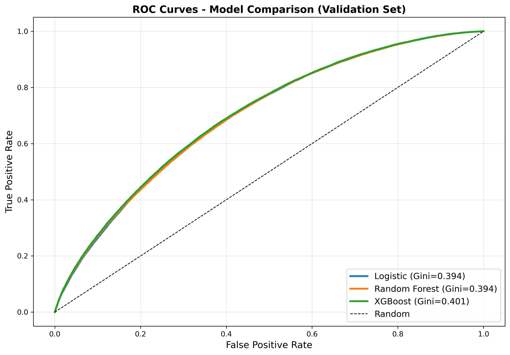

# Credit Risk Modeling: PD Model with Bayesian Uncertainty and Monte Carlo Stress Testing

A credit risk modeling project demonstrating probability of default (PD) prediction for retail lending portfolios, enhanced with Bayesian uncertainty quantification and Monte Carlo stress testing.



## Objective

Build a production-grade 12-month probability of default model for retail loans that:
- Achieves strong discrimination (Gini > 0.35)
- Provides interpretable features for regulatory compliance
- Quantifies prediction uncertainty using Bayesian methods
- Assesses portfolio risk under stress scenarios

## Data Source

Lending Club accepted loans dataset (2015-2017)
- Training set: 668,181 loans (2015-2016 originations)
- Validation set: 168,699 loans (2017 originations)
- Default rate: 21.5% (training), 23.1% (validation)
- Features: 151 raw features reduced to 10 WoE-transformed predictors

## Methods

### Feature Engineering
- Weight of Evidence (WoE) transformation for continuous variables
- Information Value (IV) calculation for feature selection
- Monotonic binning to ensure interpretability
- Population Stability Index (PSI) for drift detection

### Modeling
- Logistic Regression: Baseline scorecard model
- Random Forest: Tree-based benchmark
- XGBoost: Gradient boosting benchmark with hyperparameter tuning
- Bayesian Logistic Regression: MCMC sampling for uncertainty quantification

### Stress Testing
- Monte Carlo simulation (10,000 scenarios per stress test)
- Three scenarios: Base case, Recession (1.5x PD), Segment-specific stress
- Value-at-Risk (VaR) and Conditional Value-at-Risk (CVaR) calculations

## Project Structure
```
notebooks/
├── 01_data_inspection.ipynb              Data loading and initial exploration
├── 02_feature_engineering.ipynb          WoE transformation and feature selection
├── 03_model_development.ipynb            Logistic regression baseline model
├── 03b_ml_benchmark_models.ipynb         Random Forest and XGBoost benchmarking
├── 04_bayesian_pd_model.ipynb            Bayesian uncertainty quantification
└── 05_monte_carlo_stress_testing.ipynb   Portfolio stress testing framework

data/
├── raw/                                  Original Lending Club dataset
├── processed/                            Cleaned and feature-engineered data
└── README.md                             Data documentation

models/
├── logistic_model.pkl                    Production logistic regression model
├── random_forest_model.pkl               Random Forest benchmark
├── xgboost_model.pkl                     XGBoost benchmark
└── bayesian_trace.pkl                    Bayesian MCMC trace

figures/
├── default_by_fico.png                   Default rate by FICO score
├── roc_curve.png                         ROC curves for all models
├── calibration_plot.png                  Predicted vs observed default rates
├── model_comparison_roc.png              Model comparison
├── bayesian_credible_intervals.png       Prediction uncertainty visualization
└── monte_carlo_stress_scenarios.png      Stress testing results

reports/
├── model_performance_summary.txt         Model validation metrics
├── bayesian_model_summary.txt            Uncertainty quantification results
├── monte_carlo_stress_test_summary.txt   Stress testing analysis
└── ml_tuning_final_summary.txt           Hyperparameter tuning results

README.md                                 Project documentation
requirements.txt                          Python dependencies
```

## Results

### Model Performance

| Model | Validation Gini | Validation AUC | Overfitting |
|-------|-----------------|----------------|-------------|
| Logistic Regression | 0.3935 | 0.6968 | 0.0440 |
| Random Forest | 0.3939 | 0.6970 | 0.0496 |
| XGBoost | 0.4008 | 0.7004 | 0.0510 |

Production model selected: Logistic Regression (interpretability and governance requirements)

### Key Features (by Information Value)

1. Interest rate (IV: 0.54)
2. FICO score (IV: 0.13)
3. DTI ratio (IV: 0.08)
4. Annual income (IV: 0.03)
5. Loan amount (IV: 0.03)

### Bayesian Uncertainty Quantification

- Mean prediction uncertainty: 0.0060 (std dev)
- High-risk predictions show 5x higher uncertainty than low-risk
- 95% credible intervals enable identification of borderline cases

### Monte Carlo Stress Testing

| Scenario | Expected Default Rate | VaR 95% | CVaR 99% |
|----------|----------------------|---------|----------|
| Base Case | 22.67% | 22.83% | 22.92% |
| Recession (1.5x PD) | 34.00% | 34.16% | 34.27% |
| Segment Stress (High-risk 2x) | 32.53% | 32.68% | 32.76% |

Key finding: Recession scenario shows 11.3 percentage point increase in defaults, informing capital buffer requirements.

## License

MIT License

## Contact

Arnob Mukherjee [arnobmukherjee1988@gmail.com]
